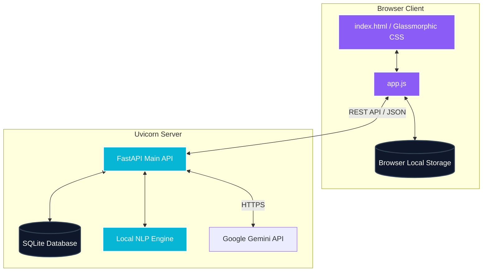

# ScribeAI - Smart Markdown Editor & Co-Writer

<!-- Badges section for resume visual appeal -->


ScribeAI is a modern, responsive, and feature-rich Markdown writing environment built with a **FastAPI (Python) backend** and a **Glassmorphic HTML/CSS/JS frontend**. 

It features real-time formatted previews, automatic local saving, and a modular **AI Co-Writer** that provides text completions, outlining, and structural enhancements. It runs fully offline using custom-built local Natural Language Processing (NLP) engines, but upgrades dynamically to state-of-the-art LLMs when a Google Gemini API key is detected.

---

## 🌟 Core Features

- ✍️ **Real-Time Dual Pane Workspace**: Split-screen editing layout with live HTML rendering, matching scrollbars, and line counters.
- 📁 **Smart Document Management**: Create, search, update, and delete drafts using an interactive sidebar.
- 💾 **Automatic DB Saving**: Features debounced background auto-saves directly to an SQLite database managed via SQLAlchemy.
- 📶 **Robust Offline Fallback**: If the backend server goes offline, the editor shifts seamlessly to caching documents inside the browser's `localStorage`, syncing back smoothly when the connection is restored.
- 📊 **Python-Powered Text Analytics**:
  - **Flesch-Kincaid Readability**: Computes difficulty metrics (e.g., *Standard*, *College Student*) dynamically.
  - **Automatic Theme Tagging**: Extracts high-frequency keyword themes using standard NLP algorithms.
  - Counters for word density, character limits, and estimated reading time.
- 🤖 **AI Co-Writing Assistant**:
  - Highlight paragraphs to **Summarize**, **Simplify**, or **Enhance Style**.
  - Click **Autocomplete** to generate logical sentence continuations or transitions.
  - Automatically structures detailed **Outlines** of selected concepts.
  - Copy or insert AI outputs directly into the editor cursor with a single click.

---

## 🏗️ Architecture



---

## 🛠️ Technology Stack

* **Backend**: Python 3, FastAPI, Uvicorn, SQLAlchemy, SQLite, Pydantic, Standard Library urllib (zero-dependency REST API requests).
* **Frontend**: HTML5, Vanilla CSS3 (Custom Variables, CSS Grid, Glassmorphism, backdrop filters), Vanilla ES6+ JavaScript, [Marked.js](https://marked.js.org/) (Markdown parser), [Lucide Icons](https://lucide.dev/).

---

## 🚀 Getting Started

### Prerequisites
* Python 3.8 or higher.

### 1. Installation & Running
Download the folder and run the launcher script. It checks your python modules and installs dependencies automatically:
```bash
# Navigate to the folder
cd smart-markdown-editor

# Run the startup script
python run.py
```
Once the script completes, open your browser and go to:
👉 **[http://127.0.0.1:8000](http://127.0.0.1:8000)**

### 2. Connecting Gemini AI (Optional)
To replace the local NLP helper scripts with Google's live Gemini LLM generation, set your API key as an environment variable in your terminal before launching the server:
* **Windows (PowerShell)**:
  ```powershell
  $env:GEMINI_API_KEY="your-gemini-api-key"
  python run.py
  ```
* **macOS/Linux**:
  ```bash
  export GEMINI_API_KEY="your-gemini-api-key"
  python run.py
  ```

---

## 🔌 API Documentation

FastAPI automatically serves interactive API docs at `http://127.0.0.1:8000/docs`.

### Core Endpoints:
| Method | Endpoint | Description |
| :--- | :--- | :--- |
| `GET` | `/api/documents` | Retrieve all saved documents (ordered by updated time). |
| `POST` | `/api/documents` | Create a new document with default title and body. |
| `PUT` | `/api/documents/{id}` | Save modifications to an existing document. |
| `DELETE` | `/api/documents/{id}` | Delete a document from the SQLite DB. |
| `POST` | `/api/ai/analyze` | Request readability metric calculations and keyword extraction. |
| `POST` | `/api/ai/transform` | Trigger AI actions (`summarize`, `simplify`, `expand`, `outline`, `autocomplete`). |

---

## 📄 License
This project is licensed under the MIT License. Feel free to use and modify it for your own resume or portfolio.
